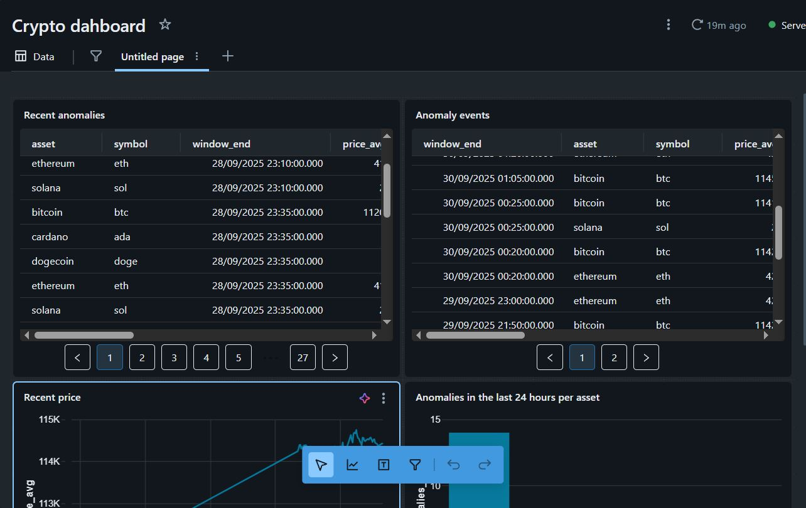
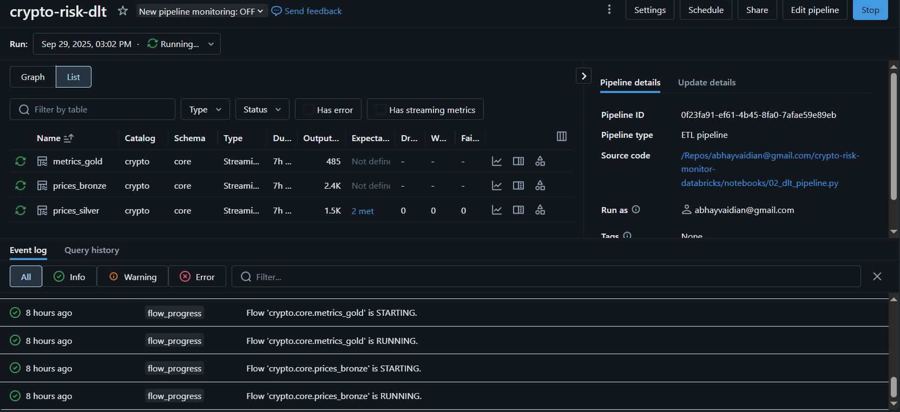

# Crypto Streaming Risk Monitor (Databricks Free Edition)

Live, governed lakehouse pipeline that ingests crypto market data, curates it into Delta Bronze / Silver / Gold using Databricks Lakehouse patterns and DLT, trains an Isolation Forest with MLflow (optionally registered to Unity Catalog Models), performs idempotent batch inference (Delta MERGE), and surfaces results in Databricks SQL dashboards.

This repository is a compact, reproducible example intended to showcase practical streaming data engineering and lightweight ML on Databricks Free Edition.




## Table of contents

- [Features](#features)
- [Architecture](#architecture)
- [Project layout](#project-layout)
- [Getting started](#getting-started)
- [How to run](#how-to-run)
- [Configuration](#configuration)
- [Validation & quick checks](#validation--quick-checks)
- [Troubleshooting & notes](#troubleshooting--notes)
- [Contact](#contact)

## Features

- Streaming ingestion from CoinGecko (public API) into a cloud volume as JSON files
- Delta medallion architecture: Bronze → Silver → Gold (watermarks, deduplication)
- Lakeflow DLT pipelines with expectations for data quality
- Unsupervised anomaly detection using scikit-learn IsolationForest and MLflow
- Idempotent batch inference using Delta MERGE
- Results surfaced via Databricks SQL dashboards (anomaly markers, leaderboards)

## Architecture

ASCII overview:

                 +--------------------+
                 |  CoinGecko API     |
                 +----------+---------+
                            |
                (01_ingest_prices.py)   writes JSONL
                            v
      UC Volume: /Volumes/crypto/core/landing/markets (or workspace volume)
                            |
                   (DLT Auto Loader)
                            v
        BRONZE   crypto.core.prices_bronze
        - raw JSON, schema evolve, _rescued, load_ts
                |
                | parse / type / quality checks
                v
        SILVER   crypto.core.prices_silver
        - typed, event_ts/ingest_ts parsed
        - watermark + dropDuplicates(event_key)  <-- streaming-safe idempotency
                |
                | 5-min windows (append after watermark)
                v
        GOLD     crypto.core.metrics_gold
        - price_avg, price_vol (sample std), price_min/max, vol_sum, ret_window
                |
                | batch-only feature (ret_prev) + MLflow train
                v
        MODEL    UC Models: crypto.core.crypto_anomaly_iforest  (alias: champion)
                |
                | batch inference (ret_prev), decision_function + MERGE
                v
        TABLE    crypto.core.anomalies
        - anomaly_score, is_anomaly, model_version, latency
                |
                +--> Databricks SQL dashboard

## Project layout

Top-level files and folders:

```
notebooks/
  01_ingest_prices.py          # API → UC volume (JSONL)
  02_dlt_pipeline.py           # DLT Bronze/Silver/Gold (watermarks + expectations)
  03_train_iforest.py          # MLflow train + UC model registration
  04_infer_iforest.py          # Batch inference + MERGE upsert (idempotent)
dlt-config/
  dlt-config.json              # DLT pipeline configuration
sql/
  dashboard.sql                # example queries for dashboards and validation
  setup.sql                    # one-time setup: catalog, schema, volume paths
README.md
```

## Getting started

Prerequisites

- A Databricks workspace (Free Edition can work for most demos, but features like Unity Catalog may be limited depending on your account).
- A Databricks cluster or Serverless SQL warehouse with a Spark runtime that supports Delta and DLT.
- Python 3.8+ (for local scripts / dev). The examples use scikit-learn and MLflow for model training.


Quick checklist

1. Clone the repo:

```bash
git clone https://github.com/abhayv2/crypto-risk-monitor-databricks.git
cd crypto-risk-monitor-databricks
```

2. Import the notebooks in `notebooks/` into your Databricks workspace (or run them from a workspace Git integration).

3. Edit `dlt-config/dlt-config.json` to match your Unity Catalog catalog/schema or a workspace path (see [Configuration](#configuration)).

4. Ensure an MLflow experiment exists (the scripts create experiments programmatically if needed).


## How to run

Run the notebooks in this order from your Databricks workspace or by executing the Python scripts on a cluster/notebook.

0) One-time setup (SQL)

- Run `sql/setup.sql` (or open and run its cells) to create the catalog, schema/database and the workspace volume paths used by the pipelines. This creates the baseline objects the notebooks and DLT expect.

1) `01_ingest_prices.py` — ingestion (Jobs)

- Purpose: ingest live price data from CoinGecko into a landing volume as JSONL.
- Schedule: every 2 minutes (Databricks Job recommended).
- Notes: this is a simple file-writer that batches API responses to the configured volume path. Use a Job with a 2-minute schedule to keep ingestion frequent but constrained.

2) `02_dlt_pipeline.py` — DLT (Bronze / Silver / Gold)

- Purpose: create and maintain Bronze → Silver → Gold medallion tables using Lakeflow DLT and Auto Loader semantics.
- Recommended mode: Continuous for development/demos (low latency) or Triggered to reduce runtime/quota costs (e.g., triggered run every 2 minutes).

Pipeline details:
- Bronze
  - Auto Loader from the UC Volume (landing JSON files)
  - Keep raw JSON, support schema evolution and `_rescued` for malformed records
- Silver
  - Parse/convert types with expectations checks and extract event_ts/ingest_ts
  - Watermark: ~20 minutes (to allow late arrivals)
  - Use dropDuplicates(event_key) after watermark for streaming-safe idempotency
- Gold
  - Build 5-minute windowed aggregates (price_avg, price_vol, min/max, vol_sum, etc.)
  - Use a shorter watermark (≈2 minutes) so windows emit in a timely manner for monitoring and ML

  

3) `03_train_iforest.py` — model training

- Purpose: compute features from Gold and train an IsolationForest; log runs to MLflow and (optionally) register the model to Unity Catalog Models.
- Data window: pull 7 days of historical rows from the Gold table for feature computation and training.
- Feature note: compute `ret_prev` (batch window + lag) as a training feature.
- Schedule: train daily or on-demand (e.g., after major data shifts or releases).
- Registering: register the trained model to UC Models as `crypto.core.crypto_anomaly_iforest` and set an alias `champion` for the current production champion model.

4) `04_infer_iforest.py` — batch inference & upsert (Jobs)

- Purpose: score new windows from Gold and upsert anomaly records into `crypto.core.anomalies` using Delta MERGE (idempotent).
- Resume logic: start from MAX(window_end) present in `crypto.core.anomalies` to avoid rescoring already-processed windows.
- Steps:
  1. Read Gold windows newer than the last `window_end` in `crypto.core.anomalies`.
  2. Compute `ret_prev` feature (batch window + lag) for the inference batch.
  3. Load the UC Model (use alias `@champion` if available or the latest model version).
  4. Score with `decision_function` and `predict()`.
  5. MERGE results into `crypto.core.anomalies` using composite key `(asset, window_end)` to ensure idempotency.
- Schedule: every 10 minutes (Databricks Job recommended).

5) Dashboard — create a Databricks SQL dashboard using the example queries in `sql/dashboard.sql`


Notes

- Job scheduling: use Databricks Jobs for ingestion and inference schedules. DLT can run continuously or be configured as a scheduled/triggered pipeline depending on cost/latency trade-offs.
- Runtime mode: Continuous mode gives lower latency (useful for demos). Triggered mode (e.g., every 2 minutes) reduces runtime time and cluster/quota usage in constrained environments such as Databricks Free Edition.
- Idempotency: MERGE operations and the DLT watermark + deduplication strategy avoid double-processing — safe to re-run the inference job.

## Configuration

- `dlt-config/dlt-config.json` — pipeline-level configuration (catalog, schema, volume path, retention, expectations). Update the following fields to match your workspace:
  - catalog (e.g. `hive_metastore` or your Unity Catalog name)
  - schema / database (e.g. `crypto_core`)
  - volume path (e.g. `/Volumes/crypto/core/landing/markets`)


## Validation & quick checks

After the DLT pipeline has run you can run quick SQL checks in Databricks SQL or a notebook cell to verify table creation and row counts:

```sql
-- list tables
SHOW TABLES IN crypto.core;

-- basic counts
SELECT COUNT(*) FROM crypto.core.prices_bronze;
SELECT COUNT(*) FROM crypto.core.prices_silver;
SELECT COUNT(*) FROM crypto.core.metrics_gold;

-- check anomalies
SELECT * FROM crypto.core.anomalies ORDER BY scored_at DESC LIMIT 100;
```

## Troubleshooting & notes

- Databricks Free Edition limits: cluster uptime and feature availability may differ from paid workspaces. If Unity Catalog or serverless features are not available, adapt the notebooks to use the workspace metastore and DBFS paths.
- If Auto Loader / DLT can't access a volume path, confirm the path exists and the cluster/service has permissions to read/write the location.
- If MLflow model registration to Unity Catalog fails, ensure you have the required UC permissions or register models in a local MLflow registry instead.

Common fixes

- Permission errors: ensure the cluster service principal / user has access to the target catalog/schema and volumes.
- Schema evolution failures: inspect `_rescued_data` fields on Bronze and update expectation rules in `02_dlt_pipeline.py`.


## Contact

- `abhayvaidian@gmail.com`

---
